ML School project
==============================

Spis
==============================
* [EDA](#EDA)
* [Metrics](#Metrics)
* [Baseline](#Baseline)
* [Preparing Data](#Preparing)
* [Model training](#Model training)
* [Results](#Results)

Description
==============================
I got 3 train / label / test csv files.
The task is to predict labels for test.csv.

EDA
==============================

```
Checking dimensions
```
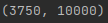

```
Showing sample data
```
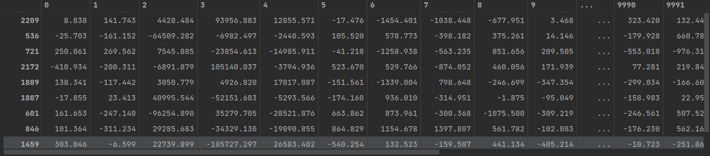

```
Counting column types (Only num)
```
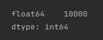

```
Counting Targets
```
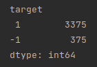

```
Counting missing values
```
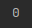

```
Counting duplicates
```


```
Counting basic metrics in dataset

We see that we have high values and that the 
average will not show any meaningful.
Variance shows how the data are similar in column
```
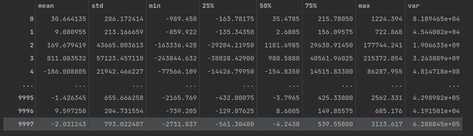

```
Showing how values are distributed.
We can see that values are normally distributed
```
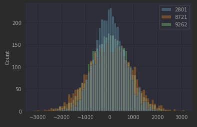

```
Checking if they are linearly separable (reloaded several times)
```
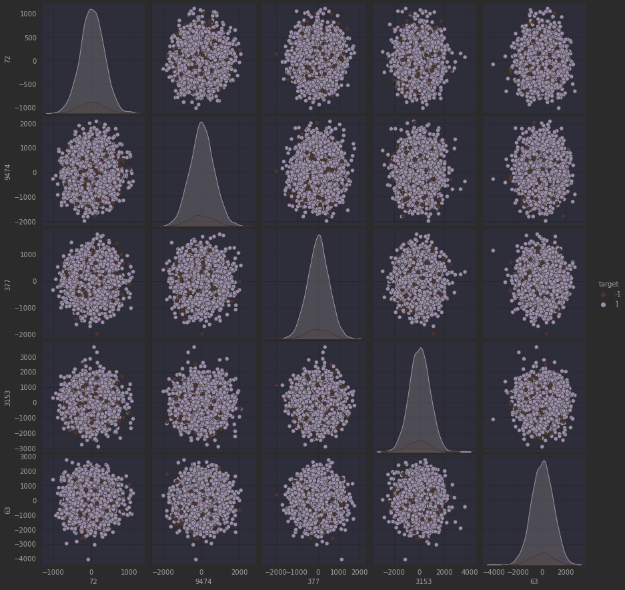

Metrics
==============================
```
The task was to predict as many correct predictions as possible,
neither class is favored. Given that the number of samples for classes
is unbalanced I chose the f1-score (Precision and Recall)
```

Baseline
==============================
```
When dividing the data, I used "stratify = y" to evenly distribute the data.
```
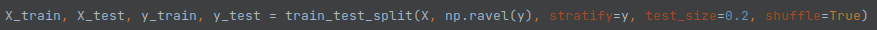

```
I used LGBM becouse the data is not linear so I was looking
woody model. The only parameter which I used for the model was:
class_weight = "balanced" because the data is not evenly distributed
```
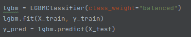

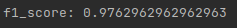

* I should have used The decision tree should be a little lighter

Preparing Data
==============================
```
Adding samples

I added samples to unbalanced dataset.
I used SMOTE because creates new similar ones
for example oversampling create rows with same values
```
```
Dimensionality reduction

PCS - it did not work for me because the data is not linearly separated
PCA + TSNE - It also did not bring satisfactory results
KernelPCA - large reduction from 10,000 col to 90.

I chose gridsearch for the selection of parameters:
n_components, gamma, kernel
```

```
Min/Max Scaler

Zmieniejszenie wartości dla polepszenia modelu
```

```
Min/Max Scaler

Change the value to improve the model
```

Model training
==============================

```
At the beginning, I chose 6 models that I tested without parameters.

Then I used hpsklearn which was set to:
classifier=any_classifier('cla'), preprocessing=any_preprocessing('pre') ,max_evals=150, trial_timeout=60

Then, when I found the classifier interested  me, I started looking
parameters:
classifier=any_classifier('cla'), max_evals=150, trial_timeout=60

I trained the model with Kfold to increase number of attempts.
I chose Kfold because dataset is already balanced by SMOT so 
I did not have to use SKfold
```

Results
==============================
```
(Bad) Model_1
Kfold cv = 10
np.mean() = 0.9997028552786172
```
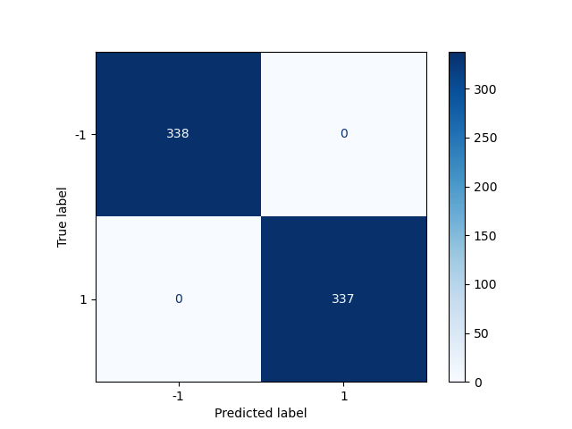

Created by Michał Banach
==============================


